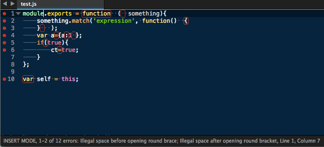

SublimeLinter-jscs
=========================

[](https://travis-ci.org/SublimeLinter/SublimeLinter-jscs)

This linter plugin for [SublimeLinter](http://sublimelinter.readthedocs.org) provides an interface to [jscs](https://github.com/mdevils/node-jscs). It will be used with files that have the “Javascript”, “JavaScript Next” or “JavaScript (JSX)” syntax.



## Installation
SublimeLinter 3 must be installed in order to use this plugin. If SublimeLinter 3 is not installed, please follow the instructions [here](http://sublimelinter.readthedocs.org/en/latest/installation.html).

### Linter installation
Before using this plugin, you must ensure that `jscs` is installed on your system. To install `jscs`, do the following:

1. Install [Node.js](http://nodejs.org) (and [npm](https://github.com/joyent/node/wiki/Installing-Node.js-via-package-manager) on Linux).

1. Install `jscs` by typing the following in a terminal:
   ```
   npm install -g jscs
   ```

1. If you are using `nvm` and `zsh`, ensure that the line to load `nvm` is in `.zshenv` and not `.zshrc`.

1. If you are using `zsh` and `oh-my-zsh`, do not load the `nvm` plugin for `oh-my-zsh`.

**Note:** This plugin requires `jscs` 1.0.10 or later, though it requires 1.9.0 or later for JSX support.

### Linter configuration
In order for `jscs` to be executed by SublimeLinter, you must ensure that its path is available to SublimeLinter. Before going any further, please read and follow the steps in [“Finding a linter executable”](http://sublimelinter.readthedocs.org/en/latest/troubleshooting.html#finding-a-linter-executable) through “Validating your PATH” in the documentation.

Once `jscs` is installed and configured, you can proceed to install the SublimeLinter-jscs plugin if it is not yet installed.

### Plugin installation
Please use [Package Control](https://sublime.wbond.net/installation) to install the linter plugin. This will ensure that the plugin will be updated when new versions are available. If you want to install from source so you can modify the source code, you probably know what you are doing so we won’t cover that here.

To install via Package Control, do the following:

1. Within Sublime Text, bring up the [Command Palette](http://docs.sublimetext.info/en/sublime-text-3/extensibility/command_palette.html) and type `install`. Among the commands you should see `Package Control: Install Package`. If that command is not highlighted, use the keyboard or mouse to select it. There will be a pause of a few seconds while Package Control fetches the list of available plugins.

1. When the plugin list appears, type `jscs`. Among the entries you should see `SublimeLinter-jscs`. If that entry is not highlighted, use the keyboard or mouse to select it.

## Settings
For general information on how SublimeLinter works with settings, please see [Settings](http://sublimelinter.readthedocs.org/en/latest/settings.html). For information on generic linter settings, please see [Linter Settings](http://sublimelinter.readthedocs.org/en/latest/linter_settings.html).

Since this plugin is executing `jscs` on your system, you may use `.jscsrc` files to configure its behavior. See the [jscs documentation](https://github.com/mdevils/node-jscs#configuration) for more information.

If you wish to run against `jsx` files, you will need to install [esprima-fb](https://www.npmjs.com/package/esprima-fb)
with `npm install -g esprima-fb` add the following lines to your `.jscsrc` file:

```json
...
    "esprima": "esprima-fb",
    "fileExtensions": [".js", ".jsx"],
...
```

**Note**: Whereas `jscs` only looks in the linted file’s directory for a `.jscsrc` file, this linter plugin extends that behavior by searching the file hierarchy up to the root directory and then in the user’s home directory.

## Contributing
If you would like to contribute enhancements or fixes, please do the following:

1. Fork the plugin repository.
1. Hack on a separate topic branch created from the latest `master`.
1. Commit and push the topic branch.
1. Make a pull request.
1. Be patient.  ;-)

Please note that modications should follow these coding guidelines:

- Indent is 4 spaces.
- Code should pass flake8 and pep257 linters.
- Vertical whitespace helps readability, don’t be afraid to use it.

Thank you for helping out!
